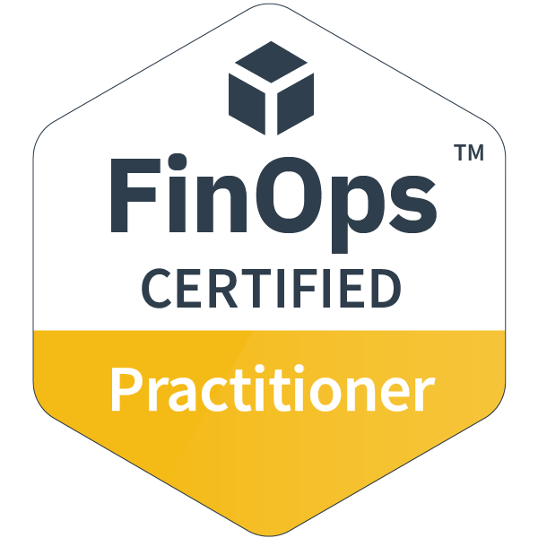
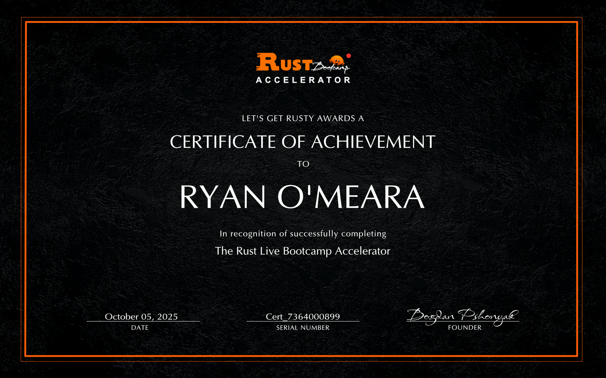
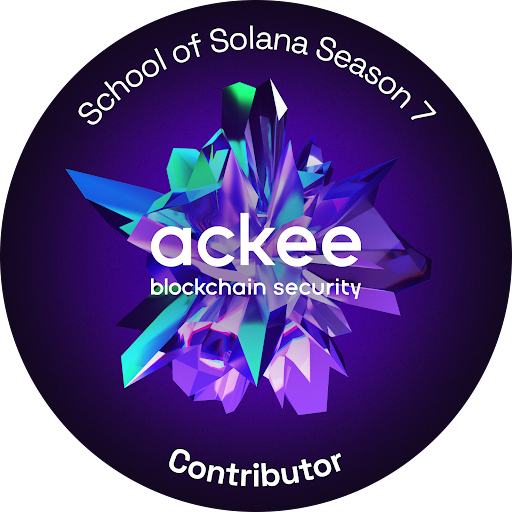

# Hi, I'm Ryan O'Meara

**FinOps Certified Practitioner | Healthcare Finance Leader (CFO) | Cloud Cost & AI Infrastructure Economics**

## About me

Federal healthcare finance leader turned FinOps practitioner. 17 years running enterprise finance at a Level 1A VA healthcare system, seven of them as CFO managing $750M+ budgets and 2,500+ FTE. Forecasting accuracy of 0.002% on a $260M payroll budget. Zero audit findings. Five consecutive Outstanding ratings, all elements Exceptional.

Now applying that discipline to cloud and AI cost management. FinOps Certified Practitioner as of April 2026. The combination most FinOps teams don't have: enterprise-scale finance leadership plus hands-on Rust on GPU infrastructure.

## What I'm looking for

FinOps and cloud financial management roles where the AI and GPU cost work is real. Open to:

- Full-time FinOps roles (analyst, manager, director)
- Fractional CFO engagements at AI and healthcare-tech companies
- Expert consulting on federal healthcare finance, cloud cost management, or AI infrastructure economics

Based in Northwest Arkansas, fully remote.

## What I'm focused on right now

- Building a public FinOps analytical pipeline ([finops-ai-workloads](https://github.com/paragoner1/finops-ai-workloads))
- Hands-on AWS cost optimization work: Cost Explorer, Trusted Advisor, Compute Optimizer, Cost Optimization Hub
- Active applications for FinOps Analyst, Manager, and Director roles in AI-heavy environments
- Conversations with healthcare-tech and AI-first companies about fractional CFO engagements

## Featured projects

**[finops-ai-workloads](https://github.com/paragoner1/finops-ai-workloads)** — A working FinOps analytical pipeline for AI and GPU cloud spend. FOCUS-formatted billing data, Python analysis scripts (parser, tag compliance, GPU cost analyzer, cost-per-inference framework), Jupyter notebook with charts. Demonstrates how the FinOps Framework applies to AI workloads end to end.

**[ore-mining-bot](https://github.com/paragoner1/ore-mining-bot)** — Production Solana mining system in Rust. 99.8% uptime, 1.2s average confirmation, 1,000+ competitive rounds. Adaptive EV-based block selection, dynamic 3-tier staking, custom Tokio async pipeline, Steel-optimized deserialization, token-bucket RPC rate limiting. The kind of compute economics and infrastructure cost modeling that translates directly to FinOps work on AI workloads.

**[crisis-companion (Solana SOS)](https://github.com/paragoner1/crisis-companion)** — Mobile emergency healthcare app for Solana Mobile. "HeySOS" voice trigger, offline Whisper AI (>95% multilingual accuracy, <150ms latency), sensor-based emergency detection, geocached first responders, automatic 911 alerts. HIPAA/GDPR compliant, AES-256 encryption. Built in Rust.

**[Ackee-School-of-Solana-Season7](https://github.com/paragoner1/Ackee-School-of-Solana-Season7)** — Advanced Solana development and security coursework. Native, Anchor, PDAs, CPIs, Token 2022, Pinocchio. 13% graduation rate. Companion repo: **[SolAudit-Tool](https://github.com/paragoner1/SolAudit-Tool)** — pure Rust CLI security auditor for smart contract vulnerability detection.

**[live-bootcamp-project](https://github.com/paragoner1/live-bootcamp-project)** — Production-grade Rust microservices from the Let's Get Rusty Live Accelerator. Auth services with SQLx, PostgreSQL, Redis, Docker Compose, JWT/Argon2 with 2FA.

## Why this combination

Most FinOps practitioners come up through cloud engineering or IT finance and have less than five years of total finance experience. Most enterprise CFOs have never written production code. The overlap of 17 years federal-grade financial discipline plus actual Rust on GPU infrastructure is rare in the FinOps talent pool.

Practically, that means I can model cost-per-inference for an AI product, run variance analysis on a $750M budget, write a Python script to parse FOCUS-formatted CUR data, and explain GPU economics to a CFO in the same conversation.

## Tech and tools

**Finance & FinOps:** FP&A, forecasting, variance analysis, cost-benefit analysis, federal appropriations, OMB A-123, FinOps Framework, FOCUS specification, AWS Cost Explorer, Compute Optimizer, Trusted Advisor

**Languages:** Rust (production), Python (analytical), TypeScript, SQL

**Cloud:** AWS (EC2, S3, GPU instances g5/p4d, Cost & Usage Reports, FOCUS data), Azure (basic)

**AI / GPU:** Whisper STT, PyTorch / Libtorch C++ bindings for Rust, GPU instance economics, inference cost modeling

**Blockchain:** Solana (Native, Anchor, PDAs, CPIs, Token 2022, Pinocchio), Ackee Blockchain Security School Season 7 graduate (13% pass rate)

**Infra:** Docker, GitHub Actions, PostgreSQL, Redis, JWT/Argon2 with 2FA

## Credentials

- FinOps Certified Practitioner (FOCP), April 2026
- Ackee School of Solana Season 7 graduate (13% pass rate)
- RareSkills Rust Security Bootcamp
- Let's Get Rusty Live Accelerator, October 2025 (Cert #7364000899)
- Master's Certificate in Federal Financial Management, Graduate School USA
- B.S. Business Administration: Accounting, University of Arkansas

&nbsp;&nbsp;

## Continuing education

Active learning track through Pluralsight (free access via Apprenticely):

- FinOps Foundations (completed)
- Tactical FinOps for AWS learning path, 6 courses (completed April 2026)
- Continuing through Pluralsight's FinOps, AWS, and cloud cost management catalog

## Connect

- LinkedIn: [linkedin.com/in/rustdevsec](https://www.linkedin.com/in/rustdevsec)
- Email: paragoner.dev@gmail.com 
